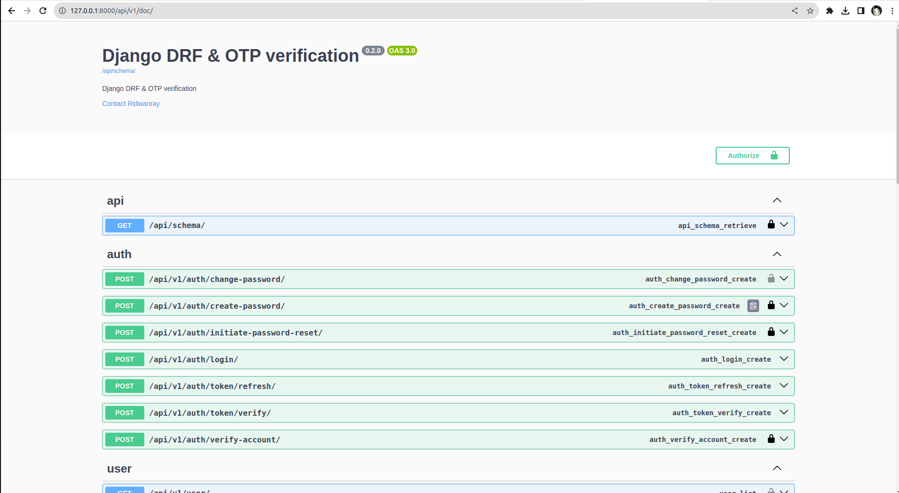
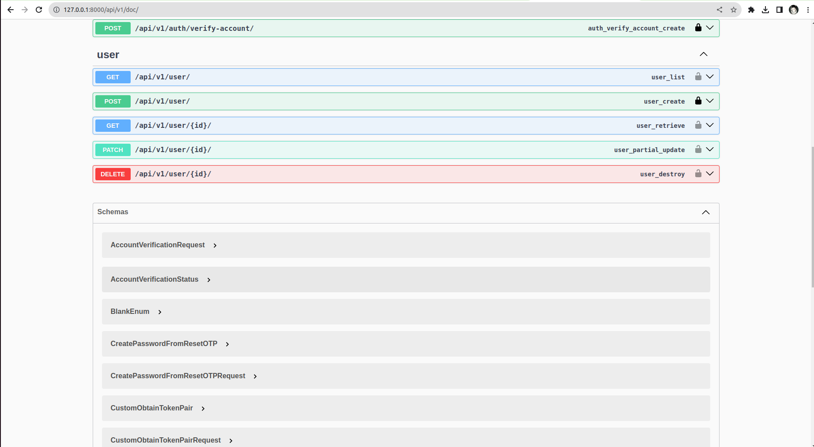

# Django - DRF & OTP verification

<p>
  <a href="https://twitter.com/talkcoding" target="_blank">
    
  </a>
</p>

👋This app shows how to handle mobile phone authentication and verification for a user management solution. <br>

## Tools & Services:
- Django & DRF : for building the APIs
- Docker & Docker compose: Containerization
- Celery: For running background task
- Rabbit MQ: A message broker for celery
- Flower dashboard: For monitoring celery background tasks
- PostgreSQL: Relational DB
- Twilio: SMS notifications


## By the end of this tutorial 
- Onboard a user on the system via phone number verification
- Reset user password via OTP sent to user.
- Authenticate a user using phone number and password

## Running locally

Create a .env file by copying the .env.sample provided and run:
```
docker compose build && docker compose up
```
to start the container. As an alternative, run:
```
docker-compose -f docker-compose.dev.yml up --build
```
to build and run the container using the dev yaml file.
Make sure to externalize the db instance to be used. It can be in another container.

## Run tests
Run descriptive tests in the container using:
```
docker compose exec <docker_container_name> pytest -rP -vv
```

Access the docs on:

```
http://localhost:8000/api/v1/doc
```


## Running In a Virtual Env

Create a virtual environment using:
```
mkvirtualenv <env_name>
```

Ensure you have installed `virtualenv` on your system and install dev dependencies using
```
pip install -r app/requirements/dev.txt
```

Navigate to app directory and run migrations using:
```
python manage.py makemigrations

python manage.py migrate
```

Run the server using:
```
python manage.py runserver
```
Access docs:
```sh
http://localhost:8000/api/v1/doc
```

<br><br><br>

<br><br><br>

